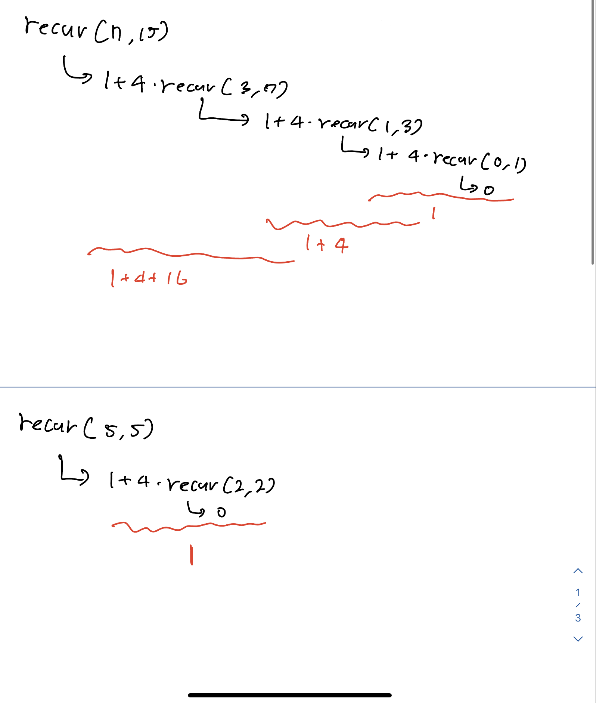

퇴사라는 제목부터 너무 매력적인 문제를 풀려고 했는데...  dp인지 dfs인지 아무튼 재귀를 써야 했다. 근데 난 재귀를 더럽게 못한다. 정말로. 젠장.

그래서 엄청 쉬운 문제부터 시작해서 재귀 문제를 차례대로 풀면서 이 약점을 극복하고자 한다

그럼 시작.

## 재귀의 귀재 - 브론즈 2

[링크](https://www.acmicpc.net/problem/25501)

이것도 못 풀면 많이 쪽팔린데ㅋㅋㅋ 사실 근데 이미 예전에 풀어봤다가 틀린 문제임. 젠장

우선 요 코드를 이해하는 것부터 해보자.

```c++
#include <stdio.h>
#include <string.h>

int recursion(const char *s, int l, int r){
    if(l >= r) return 1;
    else if(s[l] != s[r]) return 0;
    else return recursion(s, l+1, r-1);
}

int isPalindrome(const char *s){
    return recursion(s, 0, strlen(s)-1);
}

int main(){
    printf("ABBA: %d\n", isPalindrome("ABBA")); // 1
    printf("ABC: %d\n", isPalindrome("ABC"));   // 0
}
```

c긴 한데 큰 문제는 없다 뭐... 그다지 복잡한 코드도 아니다.

위 코드는 주어진 문자열이 팰린드롬인지를 확인하는 코드라고 한다. 그 확인을 위해서 재귀를 사용하는데, 왼쪽 끝과 오른쪽 끝에서 가운데까지 한 칸 한 칸씩 움직이면서 만약 두 포인터가 다른 문자를 가르킨다면 팰린드롬이 아니므로 바로 0을, 만약 포인터카 가운데에서 만나거나 교차할 때까지도 계속 같은 문자를 가르켰다면 팰린드롬이므로 1을 출력한다는 그런... 간단한 코드이다.

방금 직접 c++ 버전으로 고쳐서 코드 짜고 디버거 돌리면서 어떻게 작동하는 지도 직접 눈으로 봤다. 음. 이해한 것 같다.

이건 그냥 준 거니까 그렇고 진짜 문제는 이제 recursion이 몇 번 호출되는지를 구하는 것이다.

음. 바로 풀었다. 시간초과라는데 그 뭐지 무슨... 입출력 연결 끊는 코드를 한 번 넣어보자.

이래도 안 돼서 질문게시판 찾아보니까 인자를 포인터로 넘기라고 함. 음. 타당하다. 시도해봄.

바로해결. 내가 이 문제를 왜 못 푼거지?

정답 코드는 다음과 같다.

```c++
#include <iostream>

using namespace std;

int cnt;

int recursion(const string& s, int l, int r) {
    cnt++;
    if (l >= r) return 1;
    else if (s[l] != s[r]) return 0;
    else return recursion(s, l+1, r-1);
}

int isPalindrome(const string& s) {
    cnt = 0;
    return recursion(s, 0, s.length()-1);
}


int main() {
    int t;
    string s;

    cin >> t;

    while (t--) {
        cin >> s;
        cout << isPalindrome(s) << ' ' << cnt << '\n';
    }
}
```

전역 변수로 카운트 하나 선언해주고 처음에 팰린드롬 함수 돌릴 때 카운트를 0으로 초기화해준 다음에 매번 리커션이 소환될 때마다 카운트를 1씩 증가시킨다는 매우매우 간단한 아이디어... 근데 문자열을 포인터로 안 넘기고 그냥 통째로 넘겼더니 재귀에서 계속계속 그 문자열을 통째로 불러오려다 보니까 시간이 초과됐나보다. 생각보다 문자열이 크기가 크구나.

이쯤 되면 무려 **4달 전** 내가 왜 이 문제를 틀렸는지가 궁금해진다. 코드를 보자.

```c++
#include <iostream>

using namespace std;

int cnt;

int recursion(const string& s, int l, int r) {
    cnt++;
    if (l > r) return 1;
    else if (s[l] != s[r]) return 0;
    else return recursion(s, l+1, r-1);
}

int isPalindrome(const string& s) {
    return recursion(s, 0, s.length()-1);
}

int main() {
    ios_base :: sync_with_stdio(false);
    cin.tie(NULL);
    cout.tie(NULL);
    
    int n;
    cin >> n;
    
    while (n--) {
        string s;
        cnt = 0;
        cin >> s;
        cout << isPalindrome(s) << ' ' << cnt << '\n';
    }
    
    
    
}
```

ㅋㅋㅋ

카운트를 왜 저기서 초기화하는거야ㅋㅋㅋ 하고 생각했는데 순간 그렇게 생각할 법도 하지 않나? 싶어서 한 번 clion에 코드를 돌려봤다. 당연히 틀림.

근데 왜 틀린 지 3초만에 암. 애초에 isPalindrome 자체가 recursion을 호출하는 함수라서 그럼ㅋㅋㅋㅋㅋ 바본가

라고 생각하고 넘길 뻔 했으나 다른 사람들 코드를 보니까 다른 사람들도 반복문 호출 시점에서 카운트를 초기화시켰음에도 맞았음을 확인함. 내가 틀린 이유는 그게 아니었음...

틀린 이유 : **l > r에 == 빼먹음**

하... 그만두자ㅋㅋㅋ

isPalindrome이 recursion을 호출하는 게 카운트 횟수를 늘린다거나 그런 게 아님. 저게 뭔가 추가적으로 재귀를 한 번 더 돌린다던가 그런 게 아니라 진짜 저거로 **시작** 하는 거니까... 횟수에 영향을 주지는 않음... 완전히 착각했다

저 문제를 풀던 시절의 나는 아직 투 포인터를 배우지 않았었나 봄... 이제라도 알았으니 됐다^^

## Symmetry - 브론즈 1

[링크] (<https://www.acmicpc.net/problem/5956>)

영어문제긴 한데 브론즈니까 걍 노빠꾸로 간다...^^

무슨 노옹부 존?? 씨가 자기네 밭에 소를 둘 건데 대칭성애자라서 무족건 밭이 대칭이 되도록 소를 둘 거란다... 그래서 바닥의 정가운데가 없거나 더 이상 바닥이 안 나뉘어질 때까지 계속 소를 둔 다음에 사용한 소의 개수를 구하라는 문제...다

일단 문제는 내가 진짜 딱 못하는 재귀 유형이라 먼저 반갑고^^ n이랑 m이 많이 커보여서 세보니까 10억임. int가 21억까지니까 걍 int써도 되는 것까지는 확인 완.

이 문제가 조금 쉬워지는 건 무조건 정가운데가 존재해야 된다는데 가로든 세로든 하나라도 짝수면 바로 정가운데가 없어진다는 거다. 이건 문제에서도 알려줬음. 5x5로 시작하면 소 가운데에 둔 다음에 생기는 조그만 바닥이 2*2인데, 이러면 가운데가 없기 때문에 소를 1마리 밖에 못 둔다고 말함.

그러면 먼저 숫자가 홀수인지를 보고 맞으면 나누고... 나누고... 나누고... 하는 식으로 하면 되지 않을까 하는 상상을 해봄...

근데 나누는 거는 어떻게 해보겠는데 소의 개수를... 어떻게 구하지? 이게 고민

근데 이 문제 같은 경우에는 생각해보면... 땅을 나누는 재귀함수가 호출되는 횟수랑 소 개수의 연관관계만 구하면 바로 풀릴 거 같긴 함 왜냐하면... 계속 땅을 1/4등분하고 1/4등분 하는 걸 반복하는 거니까...

그 관계를 구해보겠습니다... 아니 원래도 고딩 때 수열 개못했음 하...

그렇네... 4의 거듭제곱만큼 계속 더해지네... 이걸 뭐라 했더라 까먹음 근데 점화식은 구할 수 있으니까 됐다... 후딱 코드 짜봄

어라라... 이산수학에서 배운 게 쓸모가 있었음...ㅋㅋㅋㅋㅋㅋㅋㅋㅋㅋㅋㅋㅋㅋㅋㅋㅋㅋㅋㅋ

오늘 마침 이산수학에서 뭘 배운 건지 모르겠다는 얘기 하고 있었는데 이걸 써먹네 개꿀ㅋㅋㅋㅋㅋㅋㅋㅋㅋㅋㅋㅋㄴㅋㅋㅋㅋㅋㅋㅋㅋㅋㅋㅋㅋㅋㅋㅋㅋ

사실 이거 소 개수도 int 범위 내에 왜 있는지 좀 증명해봐야될 거 같긴 함... 귀찮아서 걍 질렀는데 맞은 거라ㅋ

근데 아무튼 맞긴 맞았으니 코드 올림

```c++
#include <iostream>
#include <cmath>

using namespace std;

int adder = 1;
int sum = 0;

void recur(int n, int m) {
    if ((n%2 == 0 || m%2 == 0) || (n == 0 || m == 0)) return;
    sum += adder;
    adder *= 4;
    return recur((n-1)/2, (m-1)/2);
}


int main() {
    int n, m;

    cin >> n >> m;

    recur(n, m);

    cout << sum;

}
```

맞고 다른 사람들 코드 읽어보는데 흠... 나 자신을 매우매우 반성하게 됨ㅋㅋㅋㅋㅋ

점화식을 쓰고 싶었던 욕구를 억누르고 정직하게 더해서 답 구한 건 좋은데... 생각해보니 저렇게 더하는 거보다는 숫자 리턴하는 게 더 재귀적인 방법인 듯...

그리고 == 0이랑 %2 == 0은 동치잖아ㅋㅋㅋㅋㅋㅋㅋㅋㅋㅋ 뭐 == 0 꼬박꼬박 붙이는 건 아직도 0이 false인 게 머리에 잘 안 붙어서 그런 거라 노력해야 될 거 같고...

코드를 수정한 버전은 다음과 같다

```c++
#include <iostream>

using namespace std;


int recur(int n, int m) {
    if (!n%2 || !m%2) return 0;
    return 1 + 4 * recur(n/2, m/2);
}

int main() {
    int n, m;

    cin >> n >> m;

    cout << recur(n, m);
}
```

1. 리턴을 int로 바꿔서 함수 호출로 자동으로 계산되고, 값 출력까지 가능하도록 만듬
2. == 0 대신 !로 대체
3. (n-1)/2나 n/2나 값이 같으니까 (cpp 기준) -1 제거

너무 당연한 거긴 한데 아무튼 고침


함수가 계산을 어떻게 해서 답을 구하는 건지 그림을 한 번 그려봄... 나름 도움이 된 것 같다

1 + 4 x 함수에서 처음으로 함수를 완전히 빠져나올 때는 0을 리턴하니까 값이 1이 되고, 그 다음에 1 + 4x1, 1 + 4 x (1 + 4 x 1) ... 요런 식으로 결과적으로 4^(n-1) 의 값들을 연속해서 더하는 결과가 나오는 것

여기서 조금 응용해보자면 만약 이 식을 예를 들어서 3 x 함수에 리턴을 2로 바꾼다면, 그 결과값은 ~~2 * 3 ^ (n-1)~~ 의 값이 될 것...

틀림 2 * 3 ^ n임... 생각해보면 당연함 저런 함수 꼴에 앞에 더해주는 값이 없으면 그냥 거듭제곱이 될 뿐이니까... 근데 내 실수는 애초에 첫 리턴부터가 곱하기 3이 붙어있는데 그걸 간과한 거

아니면 또 2 + 4 x 함수에 리턴은 0으로 그대로 두면, 직접 해보니 2 x 4 ^ (n-1)이라는 결과가 나온다. 리턴을 1로 바꾸면, 2 x 4^(n-1)를 더한 값에 1 x 4^(n-1)을 더 더해준 정체불명의 값이 나옴...

여기서 조금 또 나아가면 만약 리턴이 3이면, 같은 값에 2 x 4^(n-1)을 더한 값이 나오겠지? 이유는 당연하니까 생략

## Rectangle - 실버 5

[링크] (<https://www.acmicpc.net/problem/7113>)

또 영어긴 한데 뭐 상관 없 실버 5기도 하고ㅋㅋ

직사각형을 가장 큰 정사각형이 나오게 나누고 나눠서 모든 조각이 정사각형이 나오게 하고, 그 때 정사각형 개수를 구하는... 고런 문제

아주 간단하게 풀었다 위에서 배운 것도 좀 응용해서ㅎㅎ 근데 max min 처리한 게 조금 비효율적으로 보이기도 해서 한 번 다른 사람들 코드는 확인해봐야 될 듯

```c++
#include <iostream>

using namespace std;

//큰 수, 작은 수 순
int recur (int n, int m) {
    if (n == m) return 1;
    else if (m == 1) return n;
    else return 1 + recur(max(m, n-m), min(m, n-m));
}

int main() {
    int n, m;

    cin >> n >> m;

    cout << recur(max(n, m), min (n, m));
}
```

처음에는 그 유클리드 호제법처럽 큰 수에서 작은 수를 빼면 무조건 나오는 결과가 작은 수보다 작을 거라고 생각했는데 그게 아니었음ㅋㅋㅋ 근데 뭐 n-m 할 때 순서는 정해줘야 되니까 결국은 이게 맞기는 한가...

다른 사람들 풀이 읽는데 재미있다 재귀 안 쓰고 그냥 반복문으로 푼 사람도 있고 (근데 어디서 재귀로 구현가능한 것들은 반복문으로도 무조건 바꿀 수 있다고 보긴 했음...) 그리고 대부분 나처럼 1줄 남으면 바로 나눠버리고 끝내는 식이 아니라 그냥 거기서도 계속 노가다하는 식으로 간 듯 그것도 뭐 나쁘지 않음...

그리고 또 짧은 길이가 세로에 여러 개 들어가면 그냥 나눠버려도 되니까 그런 식으로 푼 사람도 있는데... 오오... 생각 못해봤음... 아주 기가 막힌 발상이다... 매우 좋은 듯

생각해보니까 내가 이 문제 이해한다고 그린 그림이 있는데 거기서도 바로 위에 말한 거 같은 예시가 있었음... 그때 나눠버려도 된다는 걸 알았으면 얼마나 좋았을까^^... 뭐 시간제한 안 걸렸으니 그걸로 됐지만

마지막으로 return으로 빼니까 else 안 넣어도 되는데 괜히 넣음ㅋㅋㅋㅋ 이건 바보짓

```c++
#include <iostream>

using namespace std;

//큰 수, 작은 수 순
int recur (int n, int m) {
    if (!m) return 0;
    return n / m + recur (m, n % m);
}

int main() {
    int n, m;

    cin >> n >> m;

    cout << recur(max(n, m), min (n, m));
}
```

좀 더 깔끔하게 고쳐봄. 19등함ㅋㅋㅋㅋ 아싸

## 재귀함수가 뭔가요? - 실버 5

[링크](<(https://www.acmicpc.net/problem/17478)>)

이건 이미 푼 문제긴 한데 공부도 할 겸 다시 한 번 풀어봄ㅎㅎ

슬슬 좀 쉬워지는 감이 없지않아 있는 것 같기도 한데 뭐... 너무 지루하면 난이도 올리지 뭐

뭐 금방 풀었다.

```c++
#include <iostream>

using namespace std;

void printBar (int n) {
    int cnt = 4 * n;
    for (int i = 0; i < cnt; i++) cout << '_';
}

void recur(int cnt, int n) {
    printBar(cnt);
    cout << "\"재귀함수가 뭔가요?\"\n";
    if (cnt == n) {
        printBar(cnt);
        cout << "\"재귀함수는 자기 자신을 호출하는 함수라네\""<< '\n';
    }
    else {
        printBar(cnt);
        cout <<"\"잘 들어보게. 옛날옛날 한 산 꼭대기에 이세상 모든 지식을 통달한 선인이 있었어." << '\n';
        printBar(cnt);
        cout << "마을 사람들은 모두 그 선인에게 수많은 질문을 했고, 모두 지혜롭게 대답해 주었지." << '\n';
        printBar(cnt);
        cout << "그의 답은 대부분 옳았다고 하네. 그런데 어느 날, 그 선인에게 한 선비가 찾아와서 물었어.\"" << '\n';
        recur(cnt + 1, n);
    }

    printBar(cnt);
    cout << "라고 답변하였지." << '\n';
    return;
}

int main() {
    ios_base ::sync_with_stdio(false);
    cin.tie(NULL); cout.tie(NULL);

    int n;

    cin >> n;

    cout << "어느 한 컴퓨터공학과 학생이 유명한 교수님을 찾아가 물었다." << '\n';

    recur(0, n);

}
```

이전 코드도 넣고 싶긴 한데 그럼 글이 너무 길어져서... 걍 생략하겠다
근데 라고 답변하겠지를 두 번 쓴 게 마음에 별로 안 듬... 지금이 더 깔끔

근데 또 다른 사람들 코드 보면서 괜찮았던 점을 꼽자면... 문자열 배열로 관리하는 거? 저거 너무 길어서 오타내기 쉬움ㅋㅋㅜㅜㅜ

그거 말고는 내 풀이도 나름 나쁘지 않아서 딱히 할 말 없다. 다음~

## 큰 수 구성하기 - 실버 5

[링크] (<https://www.acmicpc.net/problem/18511>)

아니 잠만 개뜬금없는데 노래 하나만...

<iframe width="560" height="315" src="https://www.youtube.com/embed/ylGve7p_g5k" title="YouTube video player" frameborder="0" allow="accelerometer; autoplay; clipboard-write; encrypted-media; gyroscope; picture-in-picture; web-share" allowfullscreen></iframe>

이거 뭐임? 스포티파이가 마구잡이로 추천해줬는데 개좋음;;; 장르는 콜린 블런스톤 듣고 있었어서 선샤인팝 바로크팝 이쯤... 대충 60년대 후기

됐고 문제나 보자

? 이해는 했는데 이게 재귀라고? 정말? ㅋㅋㅋㅋㅋㅋ

일단 n은 1억이니까 int 걍 쓰고... k가 소트를 해서 주는건지 아닌지는 잘 모르겠는데 딱히 별 말 없는 거 봐서는 소트는 안해주는 것 같다.

근데 왜 재귀인지는 알겠네 대충... 앞에서부터 보다가 무조건 n보다 작아지는 시점 오면 바로 최대값으로만 때려박으면 될 거 같은데...

일단 먼저 코드 짜봄

```c++
#include <iostream>
#include <vector>
#include <algorithm>

using namespace std;


void recur(int idx, string n, vector<int>& arr) {
    for (int i = 0; i < arr.size(); i++) {
        if (n[idx] - '0' == arr[i]) {
            cout << arr[i];
            return recur(idx + 1, n, arr);

        }
        else if (n[idx] - '0' > arr[i]) {
            cout << arr[i];
            for (int j = 0; j < n.length() - idx -1; j++) {
                cout << arr[0];
            }
            return;
        }
    }

}

int main() {
    string n;
    int k;
    cin >> n >> k;
    vector<int> arr (k, 0);

    while (k--) {
        cin >> arr[k];
    }

    sort(arr.begin(), arr.end(), greater<>());

    recur(0, n, arr);

}
```

대충 이렇게 짜놓고 음~ 괜찮은 풀이같다^^ 이러고 있었는데? 틀림.

질문 게시판 들어가자마자 본 반례... 넣자마자 바로 왜 틀렸는지 이해 완.

73 2 7 4

내 로직대로면 일단 7이랑 7을 보고 다음 재귀로 들어갈 텐데 이러면 3보다 작은 수가 없으니까... 출력을 못하겠지? 이건 이전 자리수도 체크를 해줘야 한다는 고런 뜻

엄청 고치는 데 귀찮을 거 같진 않고 몇 줄만 추가해주면 되는데 일단 졸려서 내일 함;;